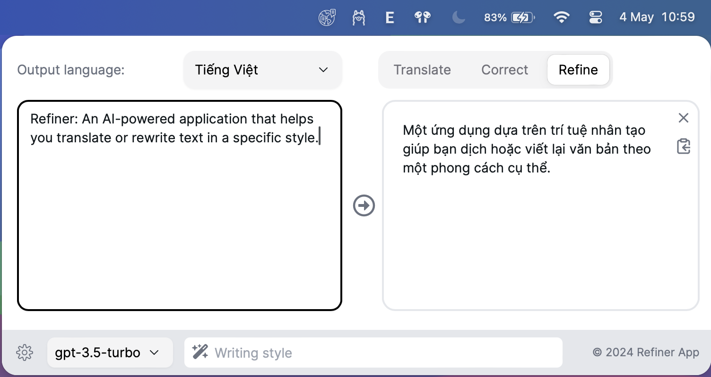
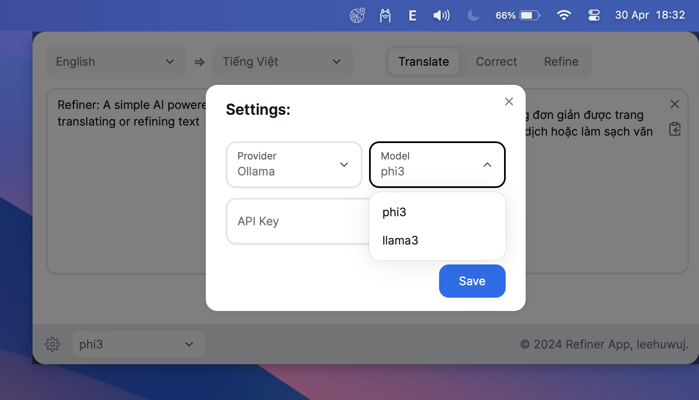

## Introduction
<table>
  <tr>
    <td style="vertical-align: middle; padding-right: 16px;">
      
    </td>
    <td style="vertical-align: middle;">
      <b>Refiner</b>: A simple AI-powered application for translating or refining text.
    </td>
  </tr>
</table>

***Note***: This app is still in development

Features:
 - [x] Translation: Translate inputted text to a target language.
 - [x] Local LLM: Use Ollama as local LLM (offline mode).
 - [x] Providers: OpenAI, Ollama, Gemini.
 - [x] Hot key: Quickly translate a selected text via shortcut key (Currently is: `Cmd + E`)
 - [] Linux support.
 - [x] Windows support.
 - [WIP] Custom prompt: Adjust the translation or text refining in different style.

## Screenshots:
- Home:

- Settings:

## Installation
1. Download the released file (.dmg for MacOS) in the [Released page](https://github.com/leehuwuj/refiner/releases)
2. Install the app.
3. Setting API key (required for OpenAI provider).
   - Click the Setting button in the bottom right cornor of the app.
   - Chose OpenAI provider and select a model.
   - Add your OpenAI's API key
   - Click `Save` to save the settings.
5. If you use `Hot key` feature that pressing `Cmd + E` to quick translate the selected text then Accessibility permission for Refiner app must be enable. Here are the steps to enable Accessibility permissions for an app on a Mac:
    - Open System Preferences (you can do this by clicking on the Apple logo in the top-left corner of your screen and selecting "System Preferences").
    - Click on "Security & Privacy".
    - Click on the "Privacy" tab.
    - Scroll down and click on "Accessibility" in the left-hand menu.
    - Click the lock icon in the bottom-left corner to make changes. You'll need to enter your password.
    - Find the app you want to grant Accessibility permissions to in the list. If it's not there, you can add it by clicking the '+' button.
    - Check the box next to the app to grant it Accessibility permissions.
    - Click the lock again to prevent further changes.
    Remember to only grant Accessibility permissions to apps you trust, as they will have increased control over your system.

> MacOS users may encounter this problem: "Refiner.app" is damaged and can't be opened. You should move it to the Trash.
 open terminal and execute:
 `xattr -c /Applications/Refiner.app`
